<div align="center">

# AquaRescue ROV

### Low-Cost Cyber-Physical Search and Rescue Platform

*An award-winning embedded robotics platform developed to assist firefighters during aquatic search operations through computer vision, embedded systems, wireless communication, and modular engineering.*

<br>

<!-- HERO IMAGE -->

<p align="center">
    
</p>

<br>


<br>

**Developed between 2023–2025**

**Colégio Militar do Corpo de Bombeiros do Ceará (CMCB)**

</div>

---

# Mission

AquaRescue was conceived to investigate how affordable robotic technologies can support firefighters during aquatic search and rescue operations.

The platform combines embedded electronics, computer vision, wireless communication, mechanical engineering, and modular design into a remotely operated robotic system capable of transmitting real-time underwater video while assisting operators in victim localization.

Rather than replacing rescue professionals, AquaRescue was designed to reduce operational risk, improve situational awareness, and demonstrate the feasibility of applying low-cost engineering solutions to public safety.

---

# Why AquaRescue?

Every year, more than **236,000 people lose their lives due to drowning**, according to the World Health Organization (WHO).

Search operations frequently involve:

- Long operational periods
- Low underwater visibility
- High physical demand
- Significant risks for rescue teams
- Emotional distress for victims' families

These challenges motivated the development of AquaRescue, a low-cost robotic platform capable of assisting firefighters during underwater search missions through real-time video transmission and computer vision.

---

# Project Highlights

- 🚒 Designed for fire department search operations
- 🤖 Low-cost remotely operated robotic platform (ROV)
- 🧠 OpenCV-based computer vision for person detection
- 📡 Real-time wireless video transmission using ESP32-CAM
- ⚙ Arduino-based embedded control architecture
- 🚤 Differential propulsion catamaran platform
- 💡 Modular underwater lighting system
- 🏆 4th Place Overall — Engineering Category — FEBRACE 2024
- 🧪 Validated through laboratory and real-world aquatic tests
- 📄 Scientific research project presented at national exhibitions

---

# Quick Overview

| Category | Description |
|----------|-------------|
| Project Type | Cyber-Physical System (CPS) |
| Application | Aquatic Search and Rescue |
| Platform | Catamaran ROV |
| Embedded Controller | Arduino Uno |
| Video System | ESP32-CAM |
| Computer Vision | Python + OpenCV |
| Communication | Bluetooth + Wi-Fi |
| Power Source | Dual 3S10P Li-Ion Battery Packs |
| Development Period | 2023–2025 |
| Current Status | Completed Research Prototype |

---

# How AquaRescue Works

AquaRescue was designed to support firefighters during aquatic search operations by combining real-time teleoperation with computer vision assistance.

Instead of replacing rescue professionals, the platform acts as an intelligent support tool, providing underwater visibility and automatic person detection while keeping operators safely outside the water whenever possible.

The operational workflow is summarized below:

1. **Remote Deployment**  
   The operator places the AquaRescue platform in the search area and establishes wireless communication with the vehicle.

2. **Navigation**  
   Using a Bluetooth controller, the operator remotely navigates the catamaran through the search region. In autonomous mode, infrared boundary sensors can keep the vehicle inside a predefined operating area.

3. **Underwater Inspection**  
   A motorized winch lowers the waterproof camera into the water, allowing inspection below the surface without exposing rescue personnel to unnecessary risks.

4. **Real-Time Video Transmission**  
   The ESP32-CAM continuously streams live underwater video over a Wi-Fi network to the operator's notebook.

5. **Computer Vision Processing**  
   The notebook receives each video frame and processes it using Python and OpenCV-based algorithms capable of detecting people in real time.

6. **Operator Assistance**  
   Whenever a potential victim is detected, the software highlights the detected region and notifies the operator, improving situational awareness during the search mission.

---

# Engineering Highlights

Unlike many educational robotics projects that focus on isolated technologies, AquaRescue integrates multiple engineering disciplines into a single cyber-physical platform.

The project combines:

- Mechanical Engineering (catamaran structure, propulsion and flotation)
- Embedded Systems (Arduino-based control architecture)
- Computer Vision (real-time person detection using OpenCV)
- Wireless Communication (Bluetooth and Wi-Fi)
- Power Electronics (regulated multi-voltage power distribution)
- Human–Machine Interface (remote operation and monitoring)

This multidisciplinary approach allowed the development of a functional research prototype capable of addressing a real public safety challenge while remaining affordable and reproducible for educational institutions.

---

# Design Philosophy

During the development process, several engineering decisions prioritized simplicity, robustness, and maintainability over unnecessary complexity.

The platform was designed according to the following principles:

- **Low Cost** — prioritize affordable and widely available components.
- **Modularity** — allow independent maintenance and future subsystem upgrades.
- **Reliability** — reduce the number of failure points during field operation.
- **Accessibility** — enable replication by educational institutions and robotics teams.
- **Real-World Validation** — validate the platform through practical demonstrations rather than simulations alone.

These principles guided every stage of the project, from the initial concept to the final prototype presented at national scientific exhibitions.

---

# Development Journey

The development of AquaRescue followed an iterative engineering process, evolving from an initial concept into a fully functional research prototype validated through laboratory and field tests.

Rather than focusing solely on the final result, the project emphasized continuous prototyping, testing, and refinement throughout its development cycle.

---

## Concept & Early Prototype

The project began with brainstorming sessions focused on identifying real problems faced by firefighters during aquatic rescue operations.

Early prototypes were developed to validate flotation, structural stability, and the feasibility of integrating a submerged vision system into a lightweight catamaran platform.

<p align="center">
    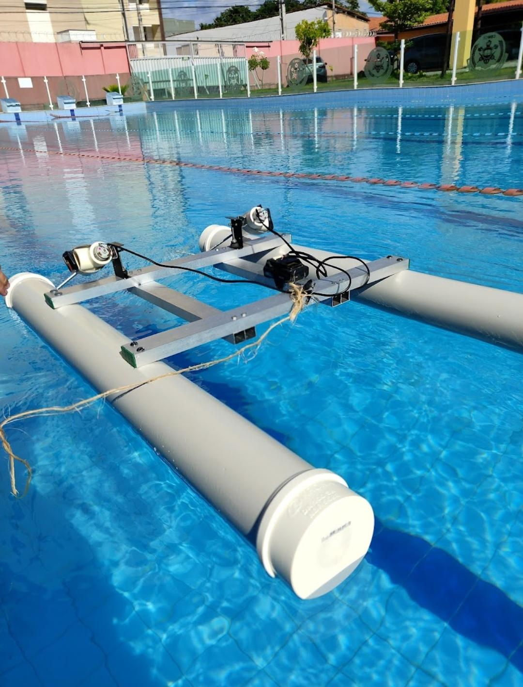
    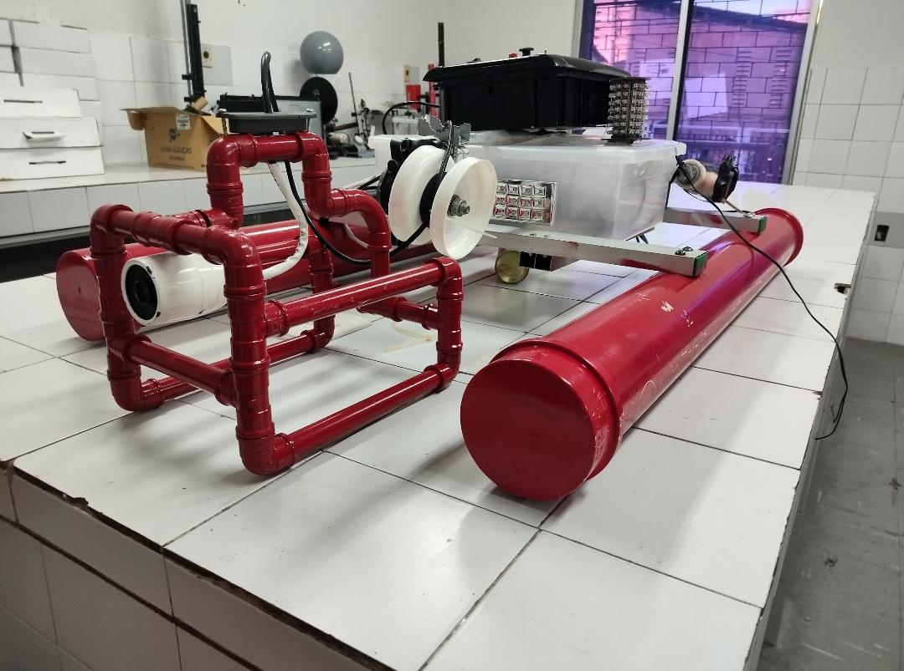
</p>

---

## Mechanical and Electronic Development

After validating the initial concept, the project entered the engineering phase.

During this stage, the propulsion system, waterproof electronics enclosure, RF control system, LED lighting, underwater camera winch, and embedded electronics were progressively integrated into the platform.

<p align="center">
    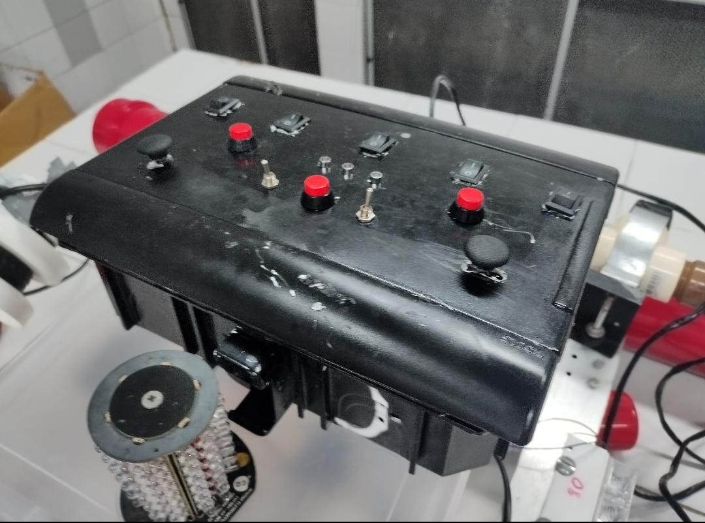
    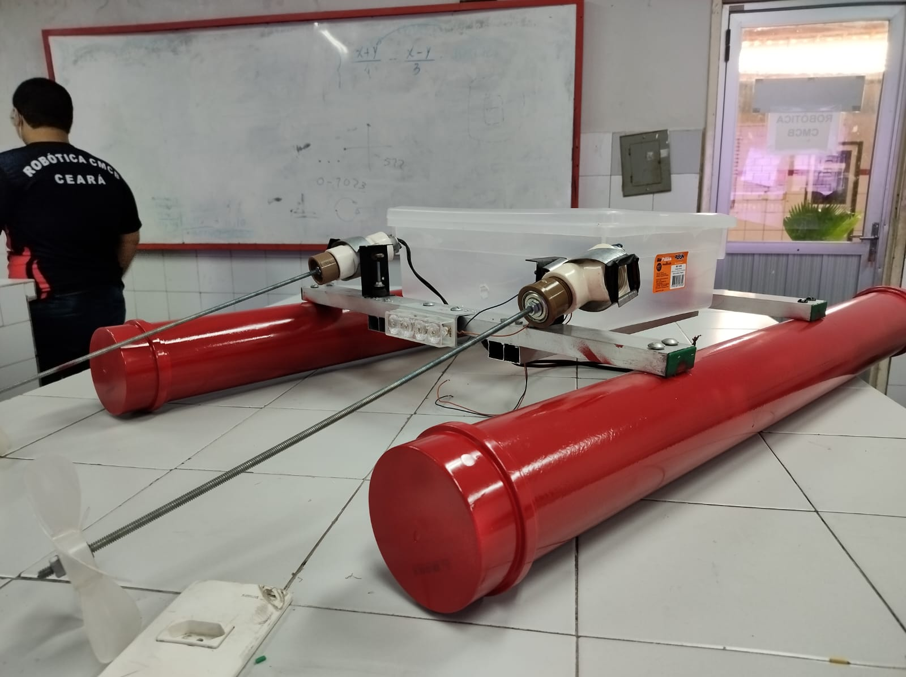
    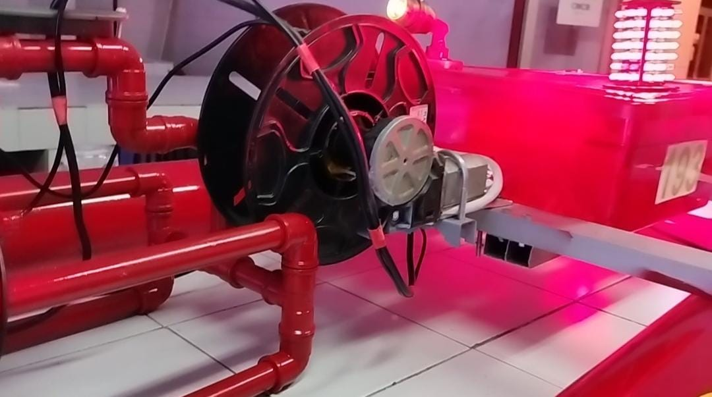
</p>

<br>

<p align="center">
    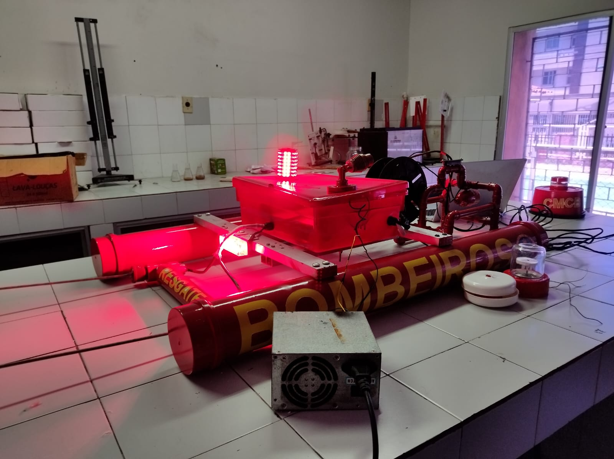
    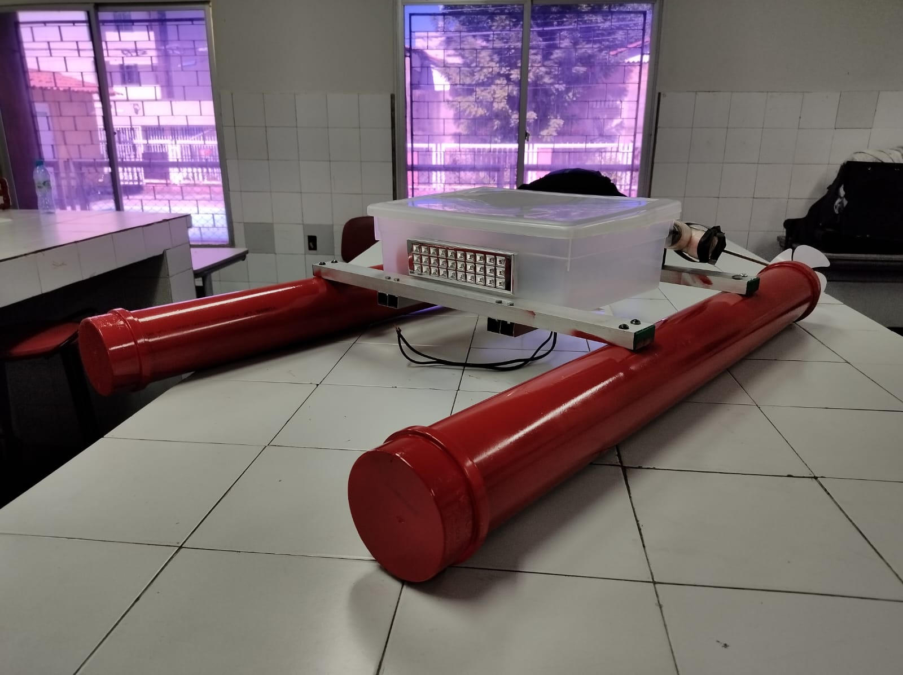
    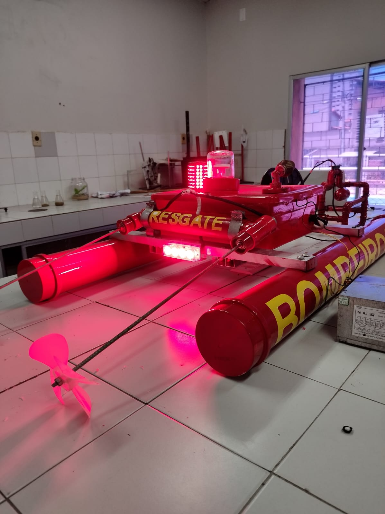
</p>

---

## Computer Vision

The underwater video stream was transmitted wirelessly to a notebook, where Python and OpenCV processed each frame in real time.

The computer vision subsystem was capable of detecting people and assisting the operator during underwater search operations.

<p align="center">
    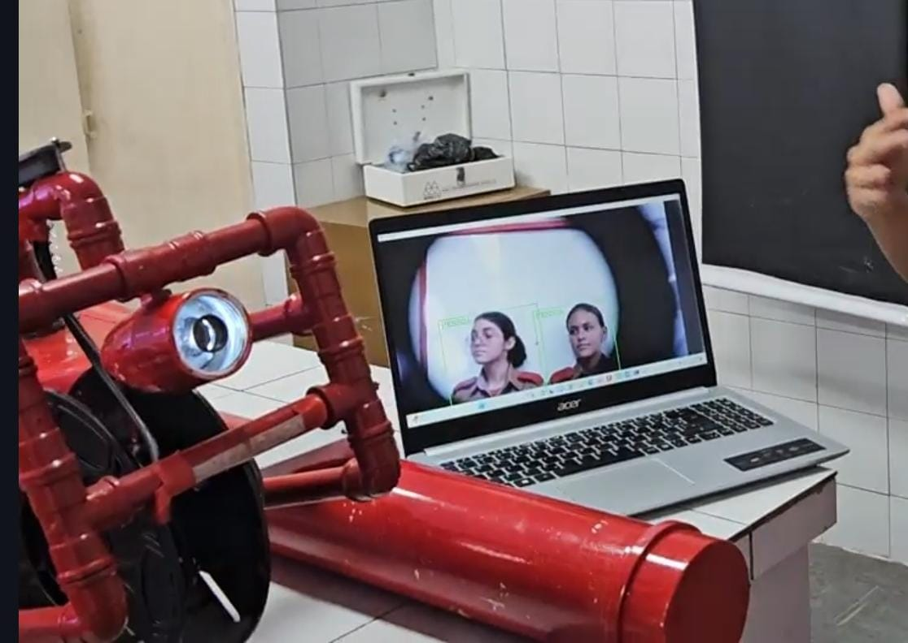
</p>

---

## Field Validation

Once the mechanical and electronic systems were integrated, AquaRescue underwent practical validation in controlled aquatic environments.

These tests evaluated propulsion, maneuverability, wireless communication, underwater visibility, and computer vision performance under realistic operating conditions.

<p align="center">
    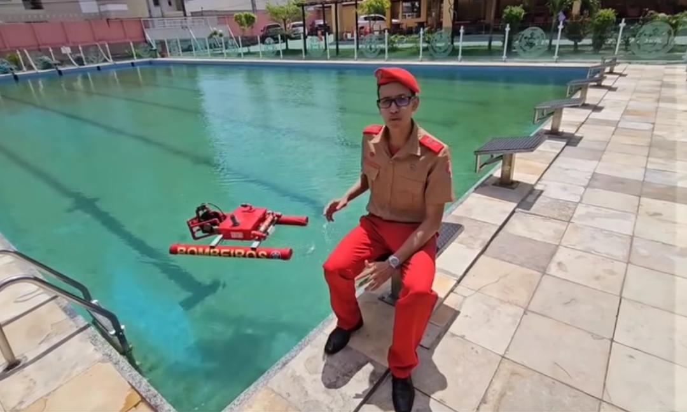
    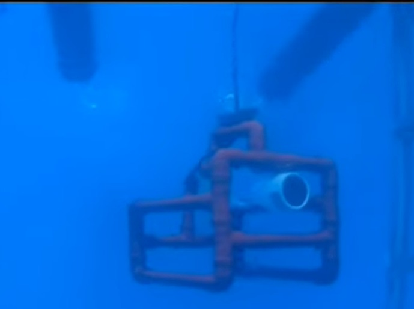
</p>

The successful validation of these tests demonstrated the feasibility of using affordable embedded technologies to support aquatic search missions.

---

# Engineering Decisions

AquaRescue was not designed by simply assembling available electronic components.

Throughout development, every major subsystem resulted from engineering trade-offs involving cost, reliability, manufacturability, maintainability, and operational requirements.

The following decisions significantly influenced the final architecture.

---

## Why a Catamaran?

Instead of adopting a conventional monohull design, the platform was built as a catamaran.

This configuration offers several engineering advantages:

- Higher buoyancy
- Improved lateral stability
- Larger payload capacity
- Reduced risk of capsizing
- Better support for lowering the underwater camera

These characteristics were particularly important because the platform needed to remain stable while operating the camera deployment mechanism and carrying batteries, embedded electronics, and propulsion components.

---

## Why Arduino Uno?

Although more powerful microcontrollers were available, the Arduino Uno was selected as the primary embedded controller because it provided:

- Proven reliability
- Extensive educational ecosystem
- Rapid prototyping capabilities
- Easy hardware integration
- Simple maintenance and troubleshooting

Its processing capacity was fully adequate for low-level control tasks such as propulsion, lighting, winch operation, and wireless command processing.

---

## Why ESP32-CAM?

Image processing is computationally demanding.

Rather than executing computer vision onboard, the ESP32-CAM was used exclusively for image acquisition and wireless video streaming.

This architecture offers several advantages:

- Reduced onboard computational load
- Higher image processing performance
- Lower hardware cost
- Simplified firmware
- Easier software upgrades

The notebook receives the video stream and performs computer vision inference using Python and OpenCV.

---

## Why External Computer Vision?

Running computer vision on an external computer allowed significantly greater flexibility during development.

Algorithms could be modified, tested, and optimized without changing the embedded firmware.

This architecture also enables future migration to more advanced deep learning models without redesigning the robotic platform itself.

---

## Why Low-Cost Components?

One of the project's primary objectives was to demonstrate that engineering solutions for public safety do not necessarily require expensive hardware.

Whenever technically feasible, recycled or commercially available components were used, including:

- PVC pipes
- Aluminum profiles
- Automotive mechanisms
- Printer components
- Consumer electronic devices

This approach reduced development costs while maintaining adequate performance for prototype validation.

---

## Design Philosophy

Every engineering decision followed five fundamental principles:

- Functionality before complexity
- Modular architecture
- Cost-effectiveness
- Ease of maintenance
- Real-world applicability

These principles allowed AquaRescue to evolve into a robust research prototype while remaining accessible for educational institutions and future research initiatives.

---

# Validation & Field Testing

Engineering projects only become meaningful when validated under conditions that resemble their intended application.

Throughout its development, AquaRescue underwent multiple stages of experimental validation to evaluate mechanical stability, propulsion, wireless communication, computer vision performance, and overall operational feasibility.

Rather than limiting evaluation to laboratory conditions, the platform was tested in real aquatic environments with the participation of firefighters and instructors.

---

## Laboratory Validation

The first validation phase focused on individual subsystem integration.

The following aspects were progressively tested:

- Mechanical assembly
- Waterproof enclosure sealing
- Differential propulsion control
- RF/Bluetooth communication
- LED lighting system
- Camera deployment mechanism
- Embedded electronics integration
- Battery autonomy

Each subsystem was validated independently before being incorporated into the complete platform.

---

## Pool Testing

The first operational tests were conducted in the swimming pool of Colégio Militar do Corpo de Bombeiros do Ceará.

These experiments allowed evaluation of:

- Buoyancy
- Stability
- Maneuverability
- Turning radius
- Camera deployment
- Wireless communication
- Operator control

<p align="center">
    
    
</p>

The platform demonstrated stable navigation and satisfactory control throughout the test sessions.

---

## Real-World Validation

After successful laboratory validation, AquaRescue was tested in a natural aquatic environment near Tabuba Beach (Ceará, Brazil).

These experiments introduced additional engineering challenges such as:

- Water movement
- Variable lighting conditions
- Greater operating distances
- Environmental disturbances

The platform maintained reliable operation and successfully transmitted live underwater images to the operator station.

---

## Computer Vision Validation

The computer vision subsystem was evaluated using real-time video transmitted from the underwater camera.

Python and OpenCV processed incoming frames and highlighted detected people directly on the operator interface.

The tests demonstrated that the proposed architecture was capable of assisting operators by providing automatic visual cues during underwater inspection.

<p align="center">
    
</p>

---

## Evaluation with Firefighters

One of the most important stages of the project involved demonstrations for firefighters from:

- Colégio Militar do Corpo de Bombeiros do Ceará (CMCB)
- Corpo de Bombeiros Militar do Ceará (CBMCE)
- Search and Rescue Battalion (BBS)

These demonstrations allowed technical discussions regarding operational applicability, usability, and possible future improvements for rescue missions.

Although AquaRescue was developed as a research prototype, interactions with experienced rescue professionals provided valuable feedback that influenced several engineering decisions throughout the project.

---

## Validation Summary

| Aspect | Result |
|---------|--------|
| Mechanical Stability | ✅ Validated |
| Catamaran Flotation | ✅ Validated |
| Differential Propulsion | ✅ Validated |
| Camera Deployment | ✅ Validated |
| Wireless Video Streaming | ✅ Validated |
| Embedded Control | ✅ Validated |
| Computer Vision | ✅ Functional |
| Field Demonstration | ✅ Successfully Performed |

The validation campaign demonstrated that the proposed low-cost architecture is technically feasible and capable of supporting future research aimed at robotic assistance during aquatic search operations.

---

# Scientific Recognition

The technical quality and social impact of AquaRescue were recognized through presentations at some of Brazil's most important science and engineering events.

Throughout its development, the project was evaluated by researchers, professors, engineers, firefighters, and science fair judges, receiving valuable technical feedback and national recognition.

---

## FEBRACE 2024 — University of São Paulo (USP)

AquaRescue represented **Colégio Militar do Corpo de Bombeiros do Ceará (CMCB)** at the **22nd Brazilian Science and Engineering Fair (FEBRACE 2024)**, hosted by the **University of São Paulo (USP)**.

The project was selected among hundreds of research projects from all regions of Brazil and achieved:

> 🏆 **4th Place Overall — Engineering Category**

The award ceremony was presented by **Iberê Thenório** and **Mari Fulfaro**, creators of the science communication channel **Manual do Mundo**, during the official closing ceremony of FEBRACE.

Beyond the award itself, the event enabled technical discussions with university professors, researchers, engineers, and innovation specialists from across the country.

<p align="center">
    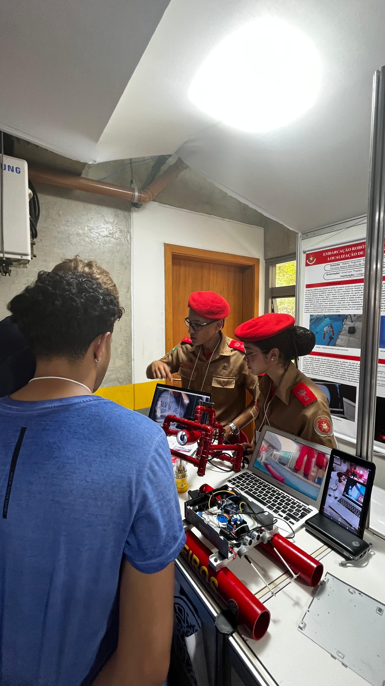
    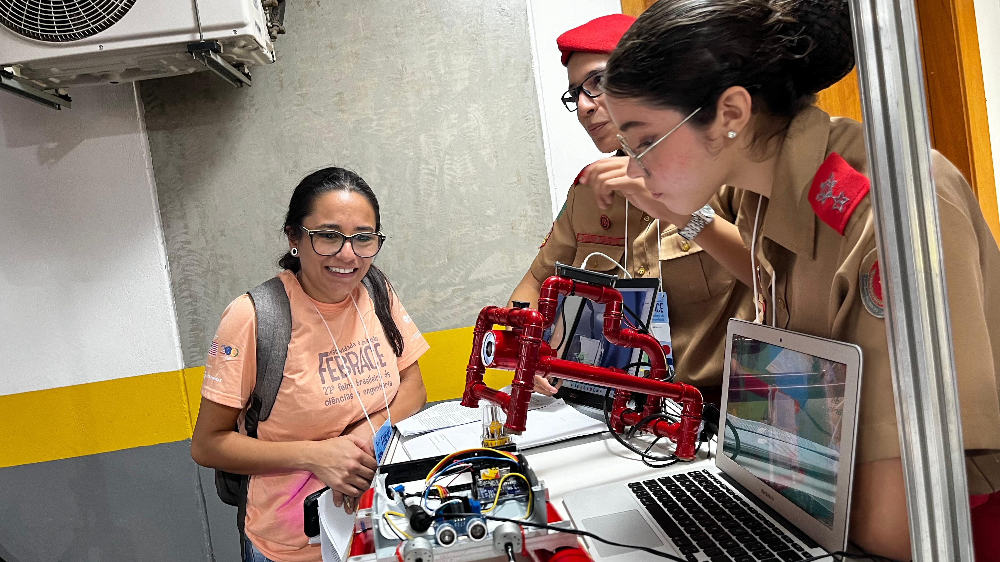
</p>

<br>

<p align="center">
    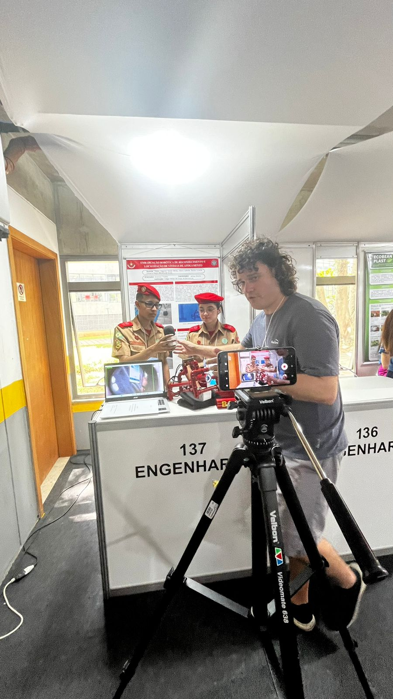
    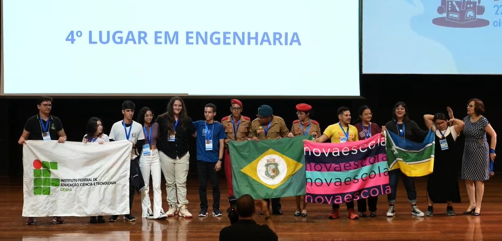
</p>

---

## Mostra Nacional de Robótica (MNR 2023)

Before competing at FEBRACE, AquaRescue was selected for presentation at the **Mostra Nacional de Robótica (MNR 2023)**, held in **Salvador, Bahia**.

The event brought together robotics teams from all over Brazil, providing an opportunity to exchange technical experiences in embedded systems, autonomous robotics, and engineering education.

<p align="center">
    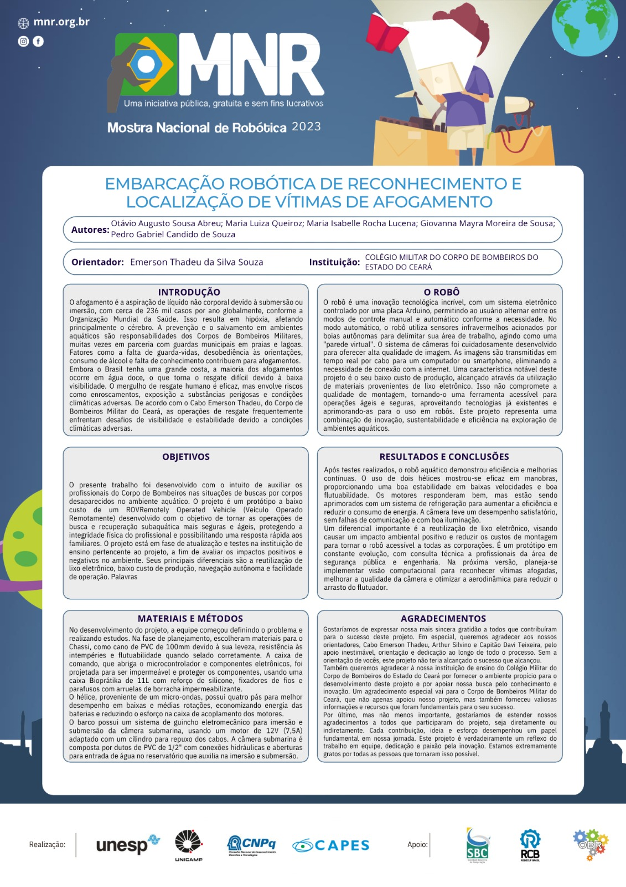
</p>

---

## Ceará Faz Ciência

The project was also exhibited during **Ceará Faz Ciência**, one of the state's largest science outreach events.

The exhibition promoted interaction with students, educators, researchers, and visitors interested in technological innovation and scientific education.

<p align="center">
    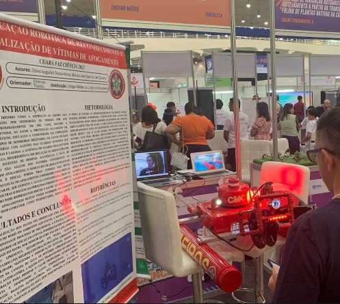
    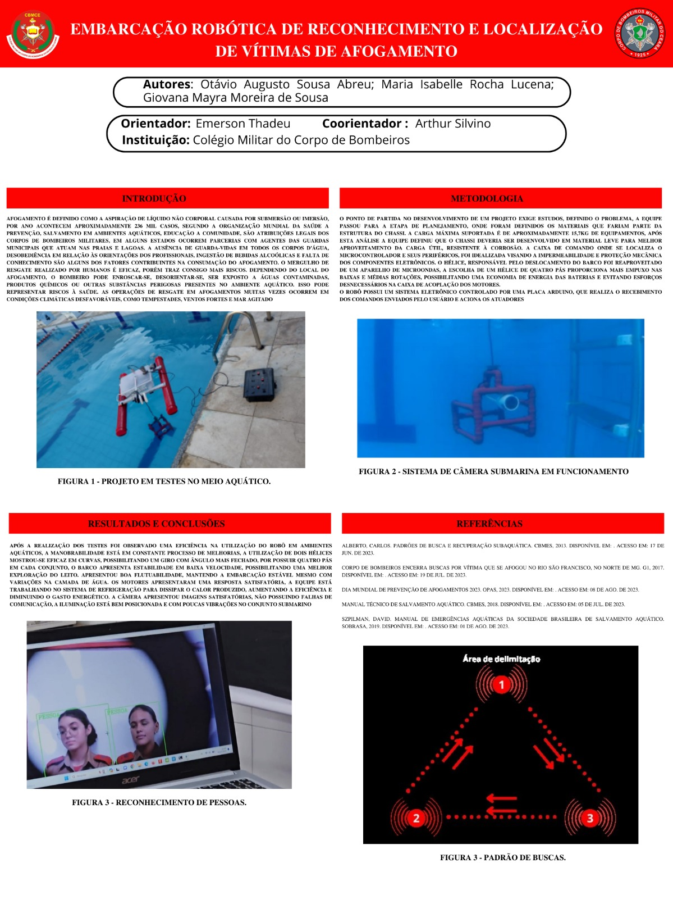
</p>

---

## UniAteneu Technology Exhibition

AquaRescue was demonstrated during a technology exhibition hosted by **UniAteneu**, where visitors could closely inspect the robotic platform and discuss its engineering concepts with the development team.

<p align="center">
    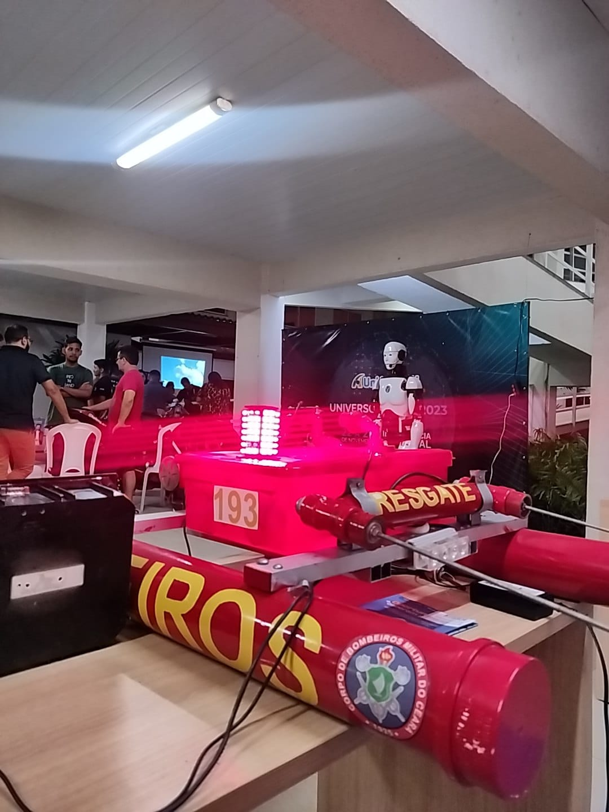
    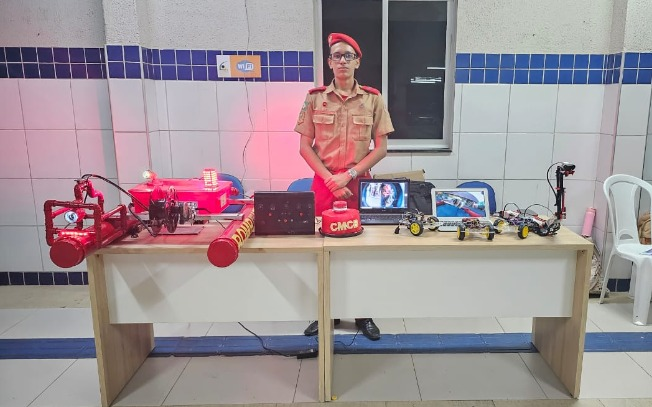
</p>

---

## Scientific Publication

The engineering methodology and experimental validation of AquaRescue resulted in a scientific publication accepted for publication in the **Enciclopédia Biosfera** scientific journal.

The article documents the complete development process, including:

- Mechanical Design
- Embedded Systems
- Computer Vision
- Wireless Communication
- Experimental Validation
- Applications for Public Safety

This publication contributes to the dissemination of affordable robotic technologies for aquatic search and rescue applications.

---

## Certificates and Academic Recognition

The project also received official academic recognition through certificates issued during FEBRACE and related scientific activities.

These include:

- FEBRACE participation certificate
- Engineering award certificate
- Scientific publication acceptance certificate
- Official event credentials

<p align="center">
    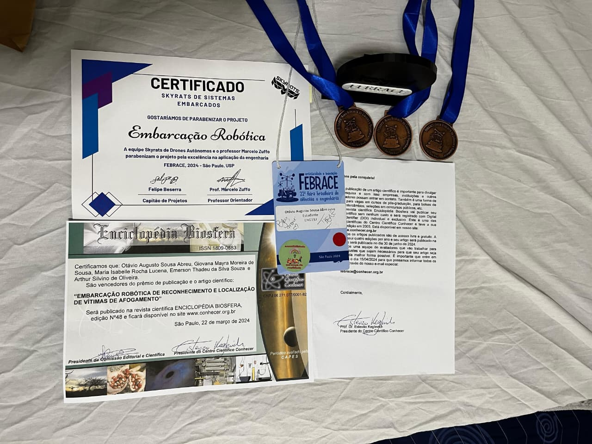
</p>

---

## Media Coverage

The project was also featured in interviews and science communication activities during national events, helping disseminate engineering and robotics to a broader audience.

<p align="center">
    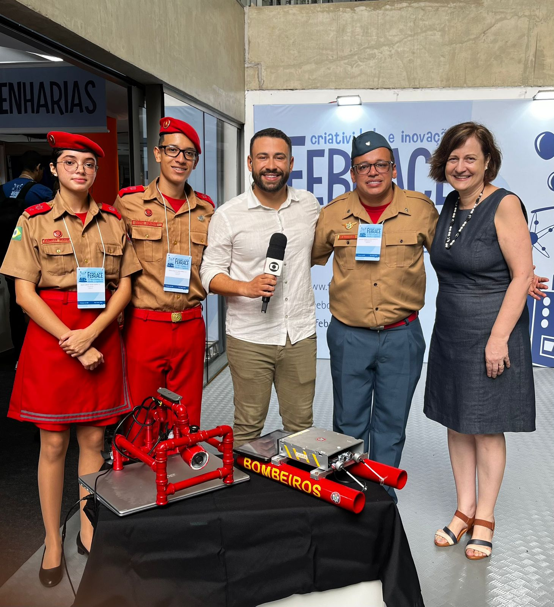
</p>

---

# Project Impact

Although originally conceived as an educational research initiative, AquaRescue evolved into a multidisciplinary engineering project with technical validation, scientific dissemination, and national recognition.

Beyond developing a functional robotic platform, the project demonstrated how affordable engineering solutions can contribute to public safety while promoting robotics education, scientific research, and technological innovation.

Its greatest contribution, however, lies in showing that low-cost cyber-physical systems can be designed, validated, and communicated following rigorous engineering principles.

---

# Technical Specifications

The following table summarizes the main engineering characteristics of the AquaRescue platform.

| Category | Specification |
|------------|-------------------------------|
| Project Name | AquaRescue ROV |
| Development Period | 2023 – 2025 |
| Project Type | Research Prototype |
| Application | Aquatic Search and Rescue |
| Architecture | Cyber-Physical System (CPS) |
| Platform | Catamaran |
| Navigation | Remote Operated Vehicle (ROV) |
| Primary Controller | Arduino Uno |
| Vision System | ESP32-CAM |
| Computer Vision | Python + OpenCV |
| Wireless Communication | Bluetooth + Wi-Fi |
| Camera Deployment | Motorized Winch |
| Propulsion | Dual 12V DC Motors |
| Hull Material | PVC + Aluminum |
| Waterproof Enclosure | Acrylic (11 L) |
| Battery System | Dual 3S10P Li-Ion (18650) Packs |
| Voltage Regulation | DC Regulators |
| Lighting | High-Power LEDs |
| Operator Interface | Notebook + Bluetooth Controller |
| Operating Modes | Manual / Semi-Autonomous |
| Validation | Laboratory and Field Tests |
| Scientific Publication | Yes |
| National Awards | Yes |

---

# Technology Stack

AquaRescue integrates multiple engineering disciplines into a single embedded robotic platform.

| Area | Technologies |
|------|--------------|
| Embedded Systems | Arduino Uno |
| Computer Vision | Python, OpenCV |
| Wireless Communication | Bluetooth, Wi-Fi |
| Electronics | Relays, Voltage Regulators, DC Motors |
| Mechanical Engineering | Catamaran Structure, Aluminum Chassis, PVC Floats |
| Power Systems | Li-Ion Battery Packs |
| Manufacturing | CAD, Mechanical Assembly, Waterproof Sealing |
| Research | Scientific Methodology, Experimental Validation |

---

# Repository Structure

```text
AquaRescue-ROV/
│
├── computer-vision/
│   ├── detect_people/
│   └── EUTIME/
│
├── diagrams/
│
├── docs/
│
├── firmware/
│
├── hardware/
│
├── images/
│
├── PROJECT_ARCHITECTURE.md
│
├── LICENSE
│
└── README.md
```

The repository is organized to separate hardware, software, engineering documentation, diagrams, and research assets, facilitating reproducibility and future maintenance.

---

# Engineering Contributions

AquaRescue required the integration of multiple engineering disciplines throughout its conception, development, validation, and scientific dissemination.

The project was not limited to software development or electronics assembly. Instead, it involved the complete engineering lifecycle of an embedded robotic system.

---

## Mechanical Engineering

- Catamaran hull design
- Flotation analysis
- Structural development
- Waterproof enclosure integration
- Underwater camera deployment mechanism
- Differential propulsion system
- Mechanical assembly and field maintenance

---

## Embedded Systems

- Arduino-based control architecture
- Embedded firmware development
- Bluetooth remote control
- Motor control
- Lighting control
- Winch control
- System integration

---

## Computer Vision

- ESP32-CAM video streaming
- Python image processing
- OpenCV integration
- Real-time person detection
- Operator visual assistance

---

## Electronics

- Power distribution
- Voltage regulation
- Relay-based motor control
- Battery management
- Wiring and electrical integration
- Waterproof electrical installation

---

## Systems Engineering

- Requirements definition
- System architecture
- Hardware/software integration
- Prototype iteration
- Experimental validation
- Technical documentation

---

## Scientific Research

- Problem investigation
- Literature review
- Engineering methodology
- Experimental design
- Scientific writing
- Technical presentations
- Research dissemination

---

# Engineering Skills Demonstrated

The development of AquaRescue involved practical experience in:

| Engineering Area | Applied |
|------------------|:-------:|
| Mechanical Design | ✅ |
| Embedded Programming | ✅ |
| Electronics | ✅ |
| Computer Vision | ✅ |
| Robotics | ✅ |
| Internet of Things | ✅ |
| Systems Integration | ✅ |
| Scientific Research | ✅ |
| Technical Writing | ✅ |
| Public Speaking | ✅ |
| Experimental Validation | ✅ |
| Engineering Documentation | ✅ |

---

# Lessons Learned

The development of AquaRescue reinforced several engineering principles that extend beyond this specific project.

Among the most important lessons were:

- Engineering is fundamentally iterative.
- Early prototyping reduces development risks.
- Simplicity often leads to more reliable systems.
- Modular architectures facilitate maintenance and upgrades.
- Real-world testing reveals challenges that simulations cannot predict.
- Multidisciplinary collaboration significantly improves project quality.
- Technical communication is as important as technical implementation.

These lessons continue to influence subsequent engineering projects developed by the team.

---

# Future Improvements

Although AquaRescue successfully validated the proposed architecture, several engineering opportunities remain for future development.

Potential improvements include:

- Autonomous navigation using GPS and waypoint planning
- Integration with sonar sensors for underwater obstacle detection
- Deep learning-based victim detection (YOLOv8)
- Thermal imaging integration
- Long-range telemetry using LoRa
- Improved waterproof housing for deeper operation
- Brushless propulsion system
- Autonomous search algorithms
- Battery management system (BMS)
- Mission logging and telemetry recording
- Web-based monitoring dashboard
- Mobile application for field operation

These improvements could transform AquaRescue from a research prototype into a more capable operational platform for aquatic search support.

---

# Repository Documentation

This repository is organized to preserve both the engineering process and the technical implementation of AquaRescue.

| Document | Description |
|-----------|-------------|
| `README.md` | Project overview and engineering summary |
| `PROJECT_ARCHITECTURE.md` | Complete engineering documentation |
| `diagrams/README.md` | System diagrams and Mermaid sources |
| `computer-vision/` | Computer vision implementation |
| `firmware/` | Embedded software |
| `hardware/` | Hardware documentation |
| `docs/` | Supporting documentation |
| `images/` | Project photographs and media |

The repository is intended to serve as both technical documentation and an educational reference for multidisciplinary robotics projects.

---

# Citation

If you use AquaRescue as inspiration for research, education, or engineering projects, please consider citing this repository.

```text
Otávio Augusto Souza Abreu et al.

AquaRescue ROV:
Low-Cost Cyber-Physical Search and Rescue Platform

GitHub Repository
https://github.com/otavioaugusto-dev/AquaRescue-ROV
```

---

# Reproducibility

AquaRescue was developed as an educational research project.

Some hardware components, firmware revisions, and prototype iterations are no longer available due to the project's long development cycle.

Nevertheless, this repository preserves the engineering architecture, development methodology, computer vision implementation, documentation, and project evolution, allowing future researchers and students to understand, reproduce, and further improve the proposed concepts.

Rather than serving solely as source code storage, this repository documents the complete engineering lifecycle of the project.

---

# Acknowledgements

AquaRescue benefited from the support, guidance, and collaboration of several institutions and professionals throughout its conception, development, validation, and scientific dissemination.

Special thanks are extended to:

- **Colégio Militar do Corpo de Bombeiros do Ceará (CMCB)** for providing the academic environment, laboratory resources, and institutional support that enabled the development of this project.

- **Corpo de Bombeiros Militar do Ceará (CBMCE)** and the **Search and Rescue Battalion (BBS)** for sharing operational knowledge, evaluating the proposed solution, and contributing valuable technical feedback during field demonstrations.

- **FEBRACE – Brazilian Science and Engineering Fair**, hosted by the **University of São Paulo (USP)**, for recognizing the project nationally and promoting scientific exchange among students, researchers, and engineering professionals.

- **Mostra Nacional de Robótica (MNR)** for fostering robotics research and providing the opportunity to present the project to the Brazilian robotics community in Salvador, Bahia.

- **Ceará Faz Ciência** for encouraging scientific dissemination and technological innovation in the state of Ceará.

- **UniAteneu** for providing an additional opportunity to publicly demonstrate the project and discuss its engineering concepts with the academic community.

Sincere appreciation is also extended to every firefighter, professor, researcher, evaluator, student, and visitor whose questions, suggestions, and technical discussions contributed to the continuous improvement of AquaRescue.

Their support helped transform an initial concept into an award-winning multidisciplinary engineering research project.

---

# About This Repository

This repository was created to preserve not only the source code of AquaRescue, but also the complete engineering process behind its development.

Rather than serving solely as a software repository, it documents the project's architecture, design decisions, experimental validation, scientific dissemination, and engineering methodology.

The objective is to provide an educational and technical reference for students, researchers, and engineers interested in embedded robotics, cyber-physical systems, computer vision, and socially impactful technology.

Every document, diagram, photograph, and source file included in this repository represents part of the engineering journey that transformed an initial idea into a nationally recognized research project.

---

# Engineering Philosophy

Engineering is not merely the process of building machines.

It is the discipline of understanding real problems, making responsible technical decisions, validating ideas through experimentation, and continuously improving solutions capable of creating a positive impact on society.

AquaRescue reflects this philosophy.

Developed from affordable components, scientific curiosity, and a commitment to continuous learning, the project demonstrates that meaningful engineering is defined not by the cost of its materials, but by the quality of its ideas, the rigor of its methodology, and the willingness to solve problems that truly matter.

---

# Final Remarks

Although AquaRescue was developed as a research prototype, the knowledge acquired throughout its conception, implementation, validation, and scientific dissemination continues to inspire new engineering projects.

It is hoped that this repository encourages other students and researchers to investigate real-world challenges, embrace multidisciplinary collaboration, and develop technologies capable of generating positive social impact.

If AquaRescue inspires even one future engineer to apply knowledge in service of society, then one of its greatest objectives will already have been achieved.

---

<div align="center">

### Built with curiosity, engineering, and purpose.

**AquaRescue ROV**

*2023 — 2025*

</div>
