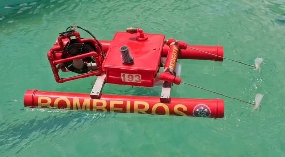

# AquaRescue ROV

### Low-Cost Cyber-Physical Search and Rescue Platform

*An award-winning embedded robotics platform developed to assist firefighters during aquatic search operations through computer vision, embedded systems, wireless communication, and modular engineering.*

 

<!-- HERO IMAGE -->

    

 

 

**Developed between 2023–2025**

**Colégio Militar do Corpo de Bombeiros do Ceará (CMCB)**

---

# Mission

AquaRescue was conceived to investigate how affordable robotic technologies can support firefighters during aquatic search and rescue operations.

The platform combines embedded electronics, computer vision, wireless communication, mechanical engineering, and modular design into a remotely operated robotic system capable of transmitting real-time underwater video while assisting operators in victim localization.

Rather than replacing rescue professionals, AquaRescue was designed to reduce operational risk, improve situational awareness, and demonstrate the feasibility of applying low-cost engineering solutions to public safety.

---

# Why AquaRescue?

Every year, more than **236,000 people lose their lives due to drowning**, according to the World Health Organization (WHO).

Search operations frequently involve:

- Long operational periods
- Low underwater visibility
- High physical demand
- Significant risks for rescue teams
- Emotional distress for victims' families

These challenges motivated the development of AquaRescue, a low-cost robotic platform capable of assisting firefighters during underwater search missions through real-time video transmission and computer vision.

---

# Project Highlights

- 🚒 Designed for fire department search operations
- 🤖 Low-cost remotely operated robotic platform (ROV)
- 🧠 OpenCV-based computer vision for person detection
- 📡 Real-time wireless video transmission using ESP32-CAM
- ⚙ Arduino-based embedded control architecture
- 🚤 Differential propulsion catamaran platform
- 💡 Modular underwater lighting system
- 🏆 4th Place Overall — Engineering Category — FEBRACE 2024
- 🧪 Validated through laboratory and real-world aquatic tests
- 📄 Scientific research project presented at national exhibitions

---

# Quick Overview

| Category | Description |
|----------|-------------|
| Project Type | Cyber-Physical System (CPS) |
| Application | Aquatic Search and Rescue |
| Platform | Catamaran ROV |
| Embedded Controller | Arduino Uno |
| Video System | ESP32-CAM |
| Computer Vision | Python + OpenCV |
| Communication | Bluetooth + Wi-Fi |
| Power Source | Dual 3S10P Li-Ion Battery Packs |
| Development Period | 2023–2025 |
| Current Status | Completed Research Prototype |

---

# How AquaRescue Works

AquaRescue was designed to support firefighters during aquatic search operations by combining real-time teleoperation with computer vision assistance.

Instead of replacing rescue professionals, the platform acts as an intelligent support tool, providing underwater visibility and automatic person detection while keeping operators safely outside the water whenever possible.

The operational workflow is summarized below:

1. **Remote Deployment**  
   The operator places the AquaRescue platform in the search area and establishes wireless communication with the vehicle.

2. **Navigation**  
   Using a Bluetooth controller, the operator remotely navigates the catamaran through the search region. In autonomous mode, infrared boundary sensors can keep the vehicle inside a predefined operating area.

3. **Underwater Inspection**  
   A motorized winch lowers the waterproof camera into the water, allowing inspection below the surface without exposing rescue personnel to unnecessary risks.

4. **Real-Time Video Transmission**  
   The ESP32-CAM continuously streams live underwater video over a Wi-Fi network to the operator's notebook.

5. **Computer Vision Processing**  
   The notebook receives each video frame and processes it using Python and OpenCV-based algorithms capable of detecting people in real time.

6. **Operator Assistance**  
   Whenever a potential victim is detected, the software highlights the detected region and notifies the operator, improving situational awareness during the search mission.

---

# Engineering Highlights

Unlike many educational robotics projects that focus on isolated technologies, AquaRescue integrates multiple engineering disciplines into a single cyber-physical platform.

The project combines:

- Mechanical Engineering (catamaran structure, propulsion and flotation)
- Embedded Systems (Arduino-based control architecture)
- Computer Vision (real-time person detection using OpenCV)
- Wireless Communication (Bluetooth and Wi-Fi)
- Power Electronics (regulated multi-voltage power distribution)
- Human–Machine Interface (remote operation and monitoring)

This multidisciplinary approach allowed the development of a functional research prototype capable of addressing a real public safety challenge while remaining affordable and reproducible for educational institutions.

---

# Design Philosophy

During the development process, several engineering decisions prioritized simplicity, robustness, and maintainability over unnecessary complexity.

The platform was designed according to the following principles:

- **Low Cost** — prioritize affordable and widely available components.
- **Modularity** — allow independent maintenance and future subsystem upgrades.
- **Reliability** — reduce the number of failure points during field operation.
- **Accessibility** — enable replication by educational institutions and robotics teams.
- **Real-World Validation** — validate the platform through practical demonstrations rather than simulations alone.

These principles guided every stage of the project, from the initial concept to the final prototype presented at national scientific exhibitions.

---
