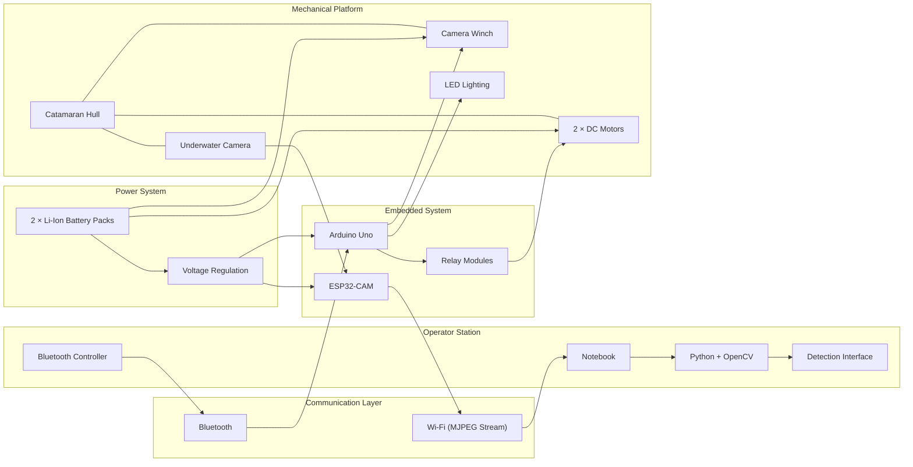
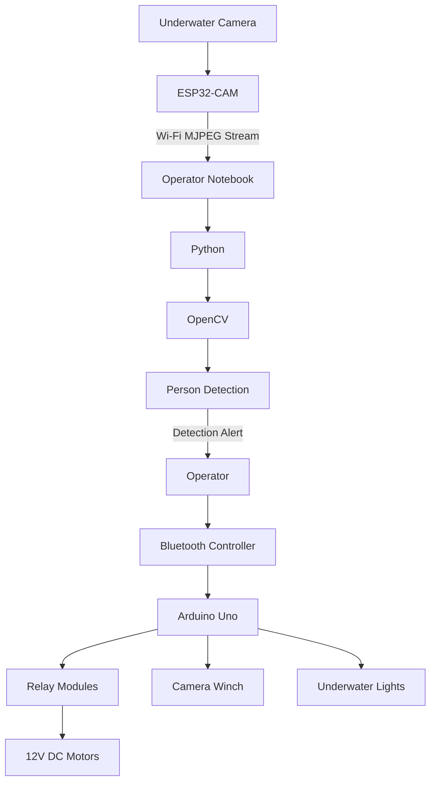
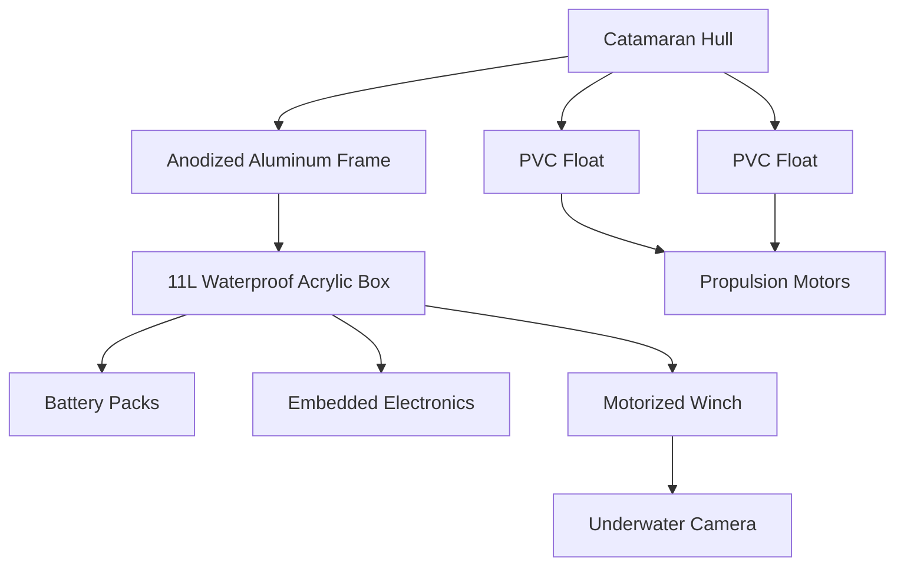
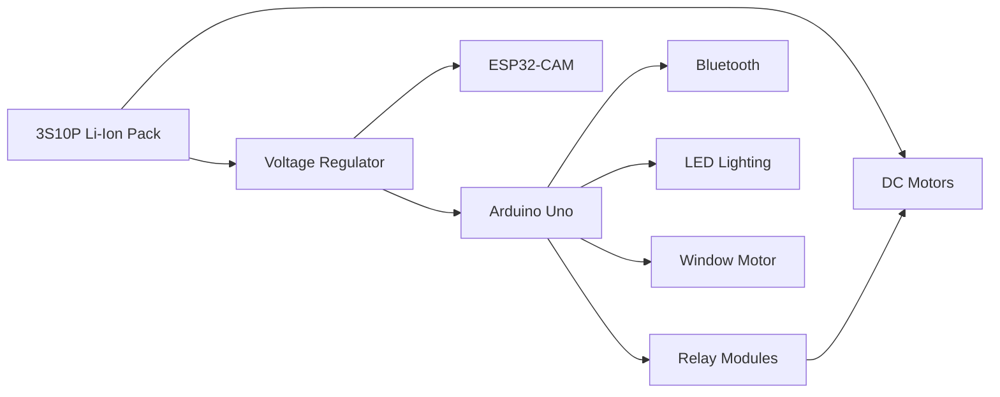
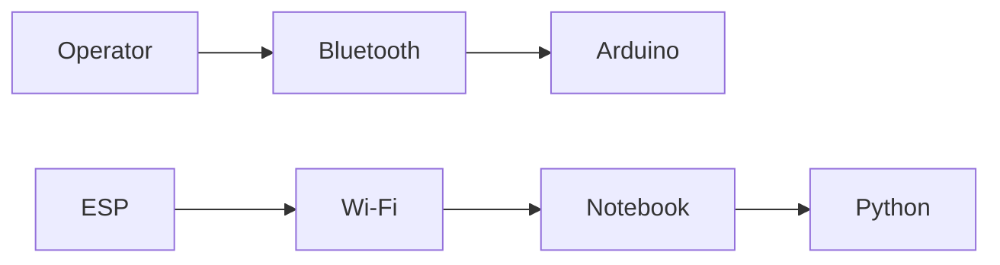
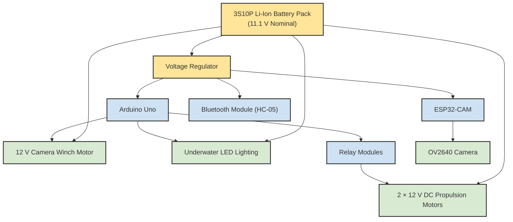
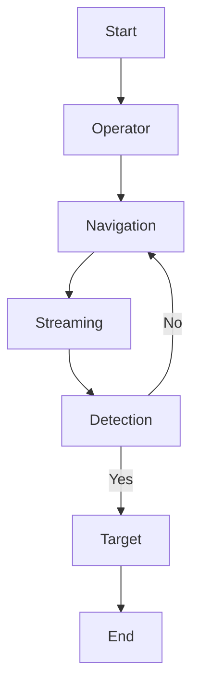

# Engineering Diagrams

This directory contains the official engineering diagrams for the **AquaRescue ROV** project.

These diagrams provide a visual representation of the system architecture and complement the technical documentation available in `PROJECT_ARCHITECTURE.md`.

Each diagram focuses on a specific subsystem and was created to improve system understanding, facilitate maintenance, and support future development.

---

# Diagram Index

|  ID  | Diagram                        | Description                                                                  | Status |
| :--: | ------------------------------ | ---------------------------------------------------------------------------- | :----: |
| D-00 | System Block Diagram | High-level Cyber-Physical System architecture. | ✅ |
| D-01 | High-Level System Architecture | Overall organization of the AquaRescue platform and subsystem interactions.  |    ✅   |
| D-02 | Mechanical Architecture        | Structural organization of the catamaran platform and mechanical components. |    ✅   |
| D-03 | Electrical Architecture        | Electrical interconnection between embedded electronics and actuators.       |    ✅   |
| D-04 | Communication Architecture     | Bluetooth and Wi-Fi communication flows between system modules.              |    ✅   |
| D-05 | Computer Vision Pipeline       | Image acquisition, processing, and person detection workflow.                |    ✅   |
| D-06 | Power Distribution             | Battery pack, voltage regulation, and subsystem power routing.               |    ✅   |
| D-07 | Mission Workflow               | Operational sequence executed during a rescue mission.                       |    ✅   |

---

# D-00 — System Block Diagram

The System Block Diagram provides a high-level overview of the AquaRescue platform, illustrating the major engineering subsystems and their interactions.

This diagram serves as the primary architectural reference for the project and summarizes the complete Cyber-Physical System (CPS) implemented during development.

---

### Engineering Notes

The AquaRescue platform follows a modular Cyber-Physical System architecture composed of five major engineering domains:

* Mechanical System
* Embedded System
* Communication System
* Computer Vision System
* Power Distribution System

Each subsystem performs a specific set of responsibilities while interacting through clearly defined interfaces. This modular organization simplifies maintenance, supports future scalability, and allows independent evolution of hardware and software components without affecting the overall system architecture.

The separation between low-level embedded control and high-level computer vision processing reduces computational requirements onboard the vehicle while enabling the use of more sophisticated image processing algorithms on the operator station.

---

# D-01 — High-Level System Architecture

This diagram presents the complete system organization.

It illustrates how the embedded controller, communication modules, operator station, propulsion system, and computer vision pipeline interact during operation.

---

# D-02 — Mechanical Architecture

This diagram represents the mechanical structure of the robotic platform, including the catamaran hull, waterproof enclosure, propulsion system, and underwater camera deployment mechanism.

---

# D-03 — Electrical Architecture

This diagram illustrates the electrical organization of the embedded system, showing the relationship between the battery pack, voltage regulation, microcontrollers, relay modules, motors, and auxiliary devices.

---

# D-04 — Communication Architecture

This diagram describes the communication infrastructure used by AquaRescue.

It highlights the separation between the Bluetooth control channel and the Wi-Fi video transmission channel.

---

# D-05 — Computer Vision Pipeline

This diagram illustrates the complete image processing workflow, from underwater image acquisition to human detection and operator notification.

---

# D-06 — Power Distribution

This diagram presents the electrical power distribution throughout the AquaRescue platform.

The propulsion system is powered directly by the battery pack, while sensitive electronic devices receive regulated voltage through dedicated voltage regulators. This separation minimizes electrical noise generated by the motors and improves overall system stability during operation.

---

### Engineering Notes

The electrical architecture intentionally separates high-current loads (propulsion and winch motors) from low-power embedded electronics. Dedicated voltage regulation supplies the Arduino Uno, ESP32-CAM, and communication modules, improving electrical stability and reducing the likelihood of voltage drops or microcontroller resets caused by motor startup currents.

This modular power distribution strategy also simplifies maintenance and future hardware upgrades by isolating power domains according to subsystem requirements.

---

# D-07 — Mission Workflow

This diagram summarizes the operational sequence followed during a typical search mission.

It represents the interaction between the operator, robotic platform, communication system, and computer vision subsystem.

---

# Design Philosophy

The AquaRescue project follows a modular systems engineering approach.

Each subsystem was intentionally designed with well-defined responsibilities, allowing independent development, easier maintenance, improved fault isolation, and future scalability.

The diagrams contained in this directory are considered the graphical reference of the project architecture and are intended to remain synchronized with the technical specification provided in `PROJECT_ARCHITECTURE.md`.

---

# Revision History

| Version | Description                          |
| ------- | ------------------------------------ |
| v0.1    | Initial engineering diagram catalog. |
